# 🗄️ ManahPro — Desain Database (PostgreSQL)

> Dokumen ini adalah **ERD + dokumentasi naratif** pendamping skema
> [`database-design.dbml`](database-design.dbml). File `.dbml` adalah _source of truth_
> struktur tabel; dokumen ini menjelaskan **mengapa** skema disusun seperti itu,
> bagaimana antar-modul saling terkait, dan pertimbangan teknis di baliknya.
>
> Disusun dari: [`business-strategy.md`](business-strategy.md),
> [`elo-ranking-system.md`](elo-ranking-system.md),
> [`ui-ux-design-guide.md`](ui-ux-design-guide.md),
> [`development-timeline.md`](development-timeline.md).
>
> **Stack**: Laravel (API) + Flutter + PostgreSQL · **Terakhir diperbarui**: 2026-05-29

---

## Daftar Isi

1. [Ringkasan & Prinsip Desain](#1-ringkasan--prinsip-desain)
2. [Model Tenancy (Multi-tenant Hybrid)](#2-model-tenancy-multi-tenant-hybrid)
3. [Peta Modul](#3-peta-modul)
4. [ERD Tingkat Tinggi (Mermaid)](#4-erd-tingkat-tinggi-mermaid)
5. [Modul per Modul](#5-modul-per-modul)
6. [Sistem Ranking (Modified Glicko-2)](#6-sistem-ranking-modified-glicko-2)
7. [Arsitektur Pembayaran & Keuangan](#7-arsitektur-pembayaran--keuangan)
8. [Strategi Offline-First (Scoring)](#8-strategi-offline-first-scoring)
9. [Pola Polymorphic (tanpa FK)](#9-pola-polymorphic-tanpa-fk)
10. [Indexing & Performa](#10-indexing--performa)
11. [Peta Implementasi Bertahap](#11-peta-implementasi-bertahap)
12. [Cara Render ERD & Generate Migration](#12-cara-render-erd--generate-migration)

---

## 1. Ringkasan & Prinsip Desain

Skema ini mencakup **seluruh 5 pilar** ManahPro (TRACK, COMPETE, TRADE, CONNECT, LEARN)
plus modul fondasi (Identity & Tenancy), Ranking, Monetization, dan Platform.
Total **~87 tabel** dalam **9 modul**, dirancang **modular** agar bisa
diimplementasikan bertahap mengikuti [development-timeline.md](development-timeline.md).

| Prinsip | Keputusan | Alasan |
| :--- | :--- | :--- |
| **Primary Key** | `ULID` (`char(26)`) di semua tabel | Bisa di-generate klien (offline-first), terurut waktu (index-friendly), tidak bocorkan jumlah baris seperti auto-increment |
| **Tenancy** | Multi-tenant **hybrid** via `organizations` | White-label siap sejak awal tanpa mengorbankan leaderboard nasional & marketplace bersama (lihat §2) |
| **Uang** | `bigint` dalam **Rupiah** (tanpa desimal) | Hindari floating-point error; Rp1.000.000 = `1000000`. Tidak perlu `decimal` karena IDR tidak punya sen |
| **Timestamp** | `timestamptz` (UTC) di `created_at` & `updated_at` semua tabel | Konsisten lintas zona waktu; konversi WIB/WITA/WIT di aplikasi |
| **Soft delete** | `deleted_at` **hanya** di tabel yang butuh restore/audit | Hindari overhead `WHERE deleted_at IS NULL` di tabel pivot/log yang tidak perlu |
| **Tipe enum** | PostgreSQL native `ENUM` (~40 enum) | Validasi di level DB, hemat ruang vs varchar. Status yang sering berubah pakai `varchar` + komentar |
| **JSON** | `jsonb` untuk data semi-terstruktur (settings, specs, targeting) | Fleksibel tanpa tabel EAV; bisa di-index dengan GIN bila perlu |
| **Polymorphic** | Kolom `*_type` + `*_id` **tanpa FK** | Satu tabel (media, payments, bookmarks, reports, audit_logs) melayani banyak entitas — lihat §9 |

### Konvensi penamaan

- Tabel: `snake_case`, **jamak** (`users`, `scoring_sessions`).
- Pivot/relasi: gabungan nama (`organization_members`, `challenge_participations`).
- FK: `<singular>_id` (`user_id`, `event_division_id`).
- Boolean: prefiks `is_` / `has_` (`is_verified`, `is_personal_best`).
- Timestamp aksi: sufiks `_at` (`paid_at`, `checked_in_at`, `published_at`).

---

## 2. Model Tenancy (Multi-tenant Hybrid)

Kebutuhan ManahPro punya **dua sifat yang tampak bertentangan**:

- **Butuh isolasi tenant** — klub/federasi/partner white-label ingin "ruang" sendiri
  (anggota, jadwal, branding, bahkan leaderboard internal).
- **Butuh data bersama lintas tenant** — leaderboard **nasional**, marketplace
  **nasional**, dan **1 manusia = 1 akun** (anti-gaming ranking).

Solusinya adalah **hybrid**, bukan isolasi penuh per-tenant:

```
                    organizations (TENANT ANCHOR)
                    ├── type=platform  → "ManahPro" root = data NASIONAL/global
                    ├── type=federation → PERPANI / Pengprov / Pengcab (parent_id hierarki)
                    ├── type=club       → klub / sasana
                    ├── type=event_organizer
                    ├── type=shop       → toko bisnis
                    └── type=partner    → brand white-label
```

### Aturan inti

1. **`organizations` adalah jangkar tenant.** Satu baris `type=platform` di-seed saat
   instalasi → mewakili "ManahPro nasional". Resource yang `organization_id`-nya
   menunjuk ke org platform = **data global**.

2. **`users` adalah identitas GLOBAL**, bukan milik tenant. Satu manusia satu akun,
   lintas semua klub/event. Ini wajib agar rating tidak bisa di-_game_ dengan
   bikin akun per-klub. Relasi user↔tenant ada di **`organization_members`**
   (dengan `role`: owner/admin/coach/scorer/member).

3. **Klub dimodelkan SEBAGAI organization** (`type=club`), bukan tabel `clubs`
   terpisah. Keanggotaan klub = baris di `organization_members`. Ini menyatukan
   logika "punya anggota, punya admin, punya branding" untuk klub/federasi/toko.

4. **`organization_id` pada tabel transaksional menentukan _scope_:**
   - `ratings.organization_id = platform` → leaderboard nasional.
   - `ratings.organization_id = <federation X>` → leaderboard white-label federasi X
     (rating dihitung dari pool event mereka sendiri).
   - `events.organization_id` → siapa penyelenggara; event "nasional" = org platform.

5. **`organizations.parent_id`** mendukung hierarki PERPANI:
   `Pengprov → Pengcab → Club`, berguna untuk agregasi & delegasi admin.

6. **`organizations.settings` (jsonb)** menampung konfigurasi white-label:
   tema, branding, fitur yang diaktifkan. Inilah yang membuat satu basis kode
   bisa melayani banyak "aplikasi" tenant.

> **Implikasi untuk query:** sebagian besar query "milik tenant" cukup menambah
> `WHERE organization_id = :tenant`. Data personal user (profil, scoring latihan,
> equipment) **tidak** di-scope tenant — ia mengikuti user ke mana pun.

---

## 3. Peta Modul

| # | Modul | Tabel inti | Pilar | Prioritas (timeline) |
| :-: | :--- | :--- | :--- | :--- |
| 0 | **Identity & Tenancy** | organizations, users, user_profiles, organization_members | Fondasi | MVP |
| 1 | **TRACK** (Scoring) | scoring_sessions, scoring_ends, scoring_arrows, personal_bests | TRACK | **MVP (North Star)** |
| 2 | **COMPETE** (Events) | events, event_divisions, event_registrations, event_scorecards | COMPETE | Fase 2 |
| 3 | **RANKING** (Glicko-2) | ratings, rating_history, rating_periods, rating_bands | COMPETE | Fase 2 |
| 4 | **TRADE** (Marketplace) | stores, products, orders, escrow_transactions | TRADE | Fase 3 |
| 5 | **CONNECT** (Community) | posts, comments, follows, conversations, coaches, ranges | CONNECT | Fase 3 |
| 6 | **LEARN** (Content/Coaching) | articles, tutorials, training_programs, coaching_bookings, achievements | LEARN | Fase 4 |
| 7 | **MONETIZATION** | subscription_plans, subscriptions, payments, payouts, platform_fees | Semua | Menyusul tiap pilar |
| 8 | **PLATFORM** (lintas-modul) | media, notifications, bookmarks, reports, audit_logs | Semua | MVP (bertahap) |

---

## 4. ERD Tingkat Tinggi (Mermaid)

Diagram ini hanya menampilkan **relasi inti antar modul** (bukan semua kolom).
ERD lengkap dengan seluruh kolom & 87 tabel: render [`database-design.dbml`](database-design.dbml)
di [dbdiagram.io](https://dbdiagram.io) (lihat §12).

```mermaid
erDiagram
    organizations ||--o{ organization_members : "punya anggota"
    users ||--o{ organization_members : "ikut tenant"
    users ||--|| user_profiles : "profil"
    organizations ||--o{ organizations : "parent (PERPANI hierarki)"

    users ||--o{ scoring_sessions : "latihan (offline-first)"
    scoring_sessions ||--o{ scoring_ends : ""
    scoring_ends ||--o{ scoring_arrows : ""
    users ||--o{ personal_bests : ""

    organizations ||--o{ events : "menyelenggarakan"
    events ||--o{ event_divisions : "kategori"
    event_divisions ||--o{ event_registrations : "peserta"
    users ||--o{ event_registrations : "daftar"
    event_divisions ||--o{ event_results : "hasil"

    event_divisions ||--o{ rating_history : "memicu update"
    users ||--o{ ratings : "punya rating/divisi"
    organizations ||--o{ ratings : "scope leaderboard"
    ratings ||--o{ rating_history : "jejak"

    users ||--o{ stores : "punya toko"
    stores ||--o{ products : ""
    users ||--o{ orders : "membeli"
    stores ||--o{ orders : "menjual"
    orders ||--|| escrow_transactions : "dana ditahan"
    orders ||--o{ order_items : ""

    users ||--o{ posts : "menulis"
    posts ||--o{ comments : ""
    users ||--o{ follows : "mengikuti"
    users ||--o{ coaches : "jadi coach"
    coaches ||--o{ coaching_bookings : ""

    users ||--o{ payments : "membayar"
    payments ||--o{ platform_fees : "ledger komisi"
    subscription_plans ||--o{ subscriptions : ""
    users ||--o{ subscriptions : "langganan (atau org)"

    users ||--o{ notifications : ""
    organizations ||--o{ subscriptions : "Club SaaS"
```



**Cara membaca relasi lintas-modul yang penting:**

- `scoring_sessions.event_division_id` (opsional) menautkan sesi scoring latihan
  ke sebuah event → satu mekanisme scoring dipakai latihan **dan** lomba.
- `rating_history.event_division_id` → setiap perubahan rating bisa dilacak ke
  divisi event sumbernya (atau `null` bila hasil seeding data legacy/PERPANI).
- `payments` bersifat **terpusat & polymorphic** (`payable_type`/`payable_id`) →
  satu tabel melayani pembayaran event, langganan, order marketplace, coaching, iklan.

---

## 5. Modul per Modul

### Modul 0 — Identity & Tenancy

| Tabel | Fungsi |
| :--- | :--- |
| `organizations` | Jangkar tenant (platform/club/federation/organizer/shop/partner). `parent_id` untuk hierarki PERPANI. `settings` jsonb untuk white-label. |
| `users` | Identitas **global** lintas tenant. 1 manusia = 1 akun. `password_hash` nullable (login sosial/HP). |
| `user_auth_providers` | Multi-metode login (Google/Apple/phone/email) per user. Unik per `(provider, provider_uid)`. |
| `user_profiles` | 1:1 dengan user. Data atletik: `primary_bow_class`, `home_club_id`, `perpani_id`, `age_group` (di-cache dari `birth_date` untuk filter ranking), `peak_title`. |
| `user_settings` | Preferensi (tema, locale ID/EN, unit). Sinkron dengan fitur theme/locale switching yang sudah ada di `features_shared/settings`. |
| `organization_members` | **Pivot** user↔tenant + `role` (owner/admin/coach/scorer/member) + `member_code` (nomor anggota unik **per organization**, nullable). Inilah "keanggotaan klub". |
| `user_verifications` | Verifikasi KTP/PERPANI/izin toko (anti-gaming & trust). |
| `user_devices` | Token FCM per device untuk push notification. `app_identifier` menandai **app mana** (multi-app/white-label) agar push diarahkan ke FCM project yang benar. Unik per `(app_identifier, fcm_token)`. |

### Modul 1 — TRACK (Scoring & Analytics) · _North Star Metric_

Mengikuti kebutuhan **offline-first** di [ui-ux-design-guide.md](ui-ux-design-guide.md).
Hierarki granular: `scoring_sessions → scoring_ends → scoring_arrows`.

| Tabel | Catatan desain |
| :--- | :--- |
| `equipment_profiles` | Multi-busur per user (Recurve Latihan, Compound Lomba). `is_default` untuk quick-start. |
| `scoring_session_groups` | **Scoring bersama** antar user (latihan grup/friendly). Host bikin sesi + `join_code`/QR; tiap peserta dapat baris `scoring_sessions` sendiri ber-`scoring_session_group_id` → statistik & PB pribadi tetap utuh, tapi berbagi **leaderboard sesi**. Lebih ringan dari event (tanpa registrasi/biaya/hasil resmi). `bow_class` tetap per-peserta; grup hanya menyepakati format ronde (jarak, jumlah end/panah). |
| `scoring_sessions` | Inti aplikasi (**milik 1 user**). Punya **agregat ter-cache** (`total_score`, `x_count`, `avg_per_arrow`) untuk dashboard cepat **tanpa** agregasi ulang per panah. Punya field **sync offline** (`client_uuid`, `source`, `synced_at`) — lihat §8. Opsional menautkan ke event (`event_division_id`) atau scoring bersama (`scoring_session_group_id`). |
| `scoring_ends` | Per-rambahan (end). `end_total` ter-cache. |
| `scoring_arrows` | Per-panah. `score_value` (0–10), `is_x` (inner-10), `is_miss`, dan `pos_x/pos_y` (koordinat target untuk _arrow pattern_ / fitur AI v2). |
| `personal_bests` | PB per `(bow_class, distance_category, num_arrows)` agar format sebanding (mis. PB 72 panah). |

### Modul 2 — COMPETE (Events, Live Scoring, Certificates)

| Tabel | Catatan |
| :--- | :--- |
| `events` | Header event. `tier` (S/A/B/C/D) menentukan bobot rating. `is_external` untuk seeding data legacy PERPANI (ranking-only, tanpa registrasi app). |
| `event_divisions` | **Kategori lomba** = `bow_class × gender × age_group × distance_category`. Inilah granularitas "rated event" pada elo doc. Membawa metadata rating: `num_participants`, `sof_avg_rating`, `rating_status`, `rated_at`. |
| `event_registrations` | Pendaftaran peserta. `qr_code` (e-ticket check-in), `payment_id`, `bib_number`. |
| `event_staff` | Penugasan scorer/official per event. |
| `event_rounds` / `event_scorecards` / `event_scorecard_ends` | Live scoring saat lomba. End disimpan **ringkas** sebagai `arrow_values` (jsonb array) — granular tapi 1 baris/end, efisien untuk live update. `event_scorecards` membawa `score_distribution` (jsonb count per nilai) + `tiebreak_key` untuk standing ronde. |
| `event_results` | Peringkat final per divisi. **Countback (Opsi C)**: `score_distribution` jsonb (jumlah X,10,9,…,1,M) untuk breakdown, dan `tiebreak_key` (seluruh jenjang countback ter-encode fixed-width) sehingga `ORDER BY total_score DESC, tiebreak_key DESC` = peringkat final **1-pass & index-ordered**. `rank` disimpan sebagai hasil resolusi countback. |
| `digital_certificates` | Sertifikat digital dengan `verification_code` untuk verifikasi publik. |

### Modul 3 — RANKING

Lihat penjelasan mendalam di [§6](#6-sistem-ranking-modified-glicko-2).

### Modul 4 — TRADE (Marketplace)

| Tabel | Catatan |
| :--- | :--- |
| `stores` | C2C (`is_business=false`) atau toko bisnis (terhubung `organization_id` type=shop). `trust_score`, `rating_avg`. |
| `product_categories` | Kategori berjenjang (`parent_id`). |
| `products` / `product_variants` | Produk + varian (ukuran/spec). `weight_grams` untuk kalkulasi ongkir RajaOngkir. `condition` (new/like_new/...). |
| `product_offers` | **Nego harga** (pain point komunitas): tawar, counter, accept/reject. |
| `shipping_addresses` | Alamat + `rajaongkir_city_id` mapping. |
| `shopping_carts` / `cart_items` | Keranjang. |
| `orders` / `order_items` | **1 order = 1 store** (multi-store checkout dipecah). `title_snapshot` & `unit_price` di-snapshot saat beli. |
| `escrow_transactions` | **Rekening bersama** — dana ditahan sampai buyer konfirmasi terima (TRADE pain point #3: penipuan). |
| `order_shipments` | Tracking kurir. |
| `product_reviews` | Hanya pembeli terverifikasi (`order_item_id` unik). |
| `marketplace_disputes` / `dispute_evidences` | Resolusi sengketa + bukti. |
| `promoted_listings` | Iklan produk berbayar (revenue stream). |

### Modul 5 — CONNECT (Community, Social, Clubs, Coaches, Ranges)

| Tabel | Catatan |
| :--- | :--- |
| `posts` / `post_likes` / `comments` / `comment_likes` | Feed sosial. `posts.shared_type/shared_id` (polymorphic) untuk share scorecard/hasil event/produk. `visibility` (public/followers/club/private). |
| `follows` | Graf sosial follower↔followee. |
| `conversations` / `conversation_participants` / `messages` | Chat: direct, club_group, event_group. |
| `club_schedules` / `club_attendances` | Jadwal latihan klub (`recurrence_rule` iCal RRULE) + presensi. |
| `coaches` / `coach_reviews` | Profil pelatih + ulasan (booking detail di Modul 6). |
| `ranges` | Direktori lapangan panahan (geo `lat/lng`, fasilitas jsonb). |

### Modul 6 — LEARN (Content, Coaching, Achievements, Gamification)

| Tabel | Catatan |
| :--- | :--- |
| `article_categories` / `articles` | Artikel (termasuk `is_islamic` untuk konten panahan Sunnah). `sponsored_content_id` untuk konten bersponsor. |
| `tutorials` | Video tutorial (`is_premium` untuk gating langganan). |
| `training_programs` / `training_program_items` | Program latihan terstruktur per hari. |
| `program_enrollments` / `program_progress` | Pendaftaran & progres user; `program_progress.scoring_session_id` menautkan latihan nyata ke item program. |
| `coach_availabilities` / `coaching_bookings` | Slot & booking sesi coaching (online/offline). `commission` = potongan platform. |
| `achievements` / `user_achievements` | Badge & pencapaian (`criteria` jsonb). |
| `user_gamification` | XP, level, **streak** harian (retensi). |
| `challenges` / `challenge_participations` | Tantangan (mis. Sunnah Challenge), `goal`/`progress` jsonb. |

### Modul 7 — MONETIZATION & BILLING

Lihat [§7](#7-arsitektur-pembayaran--keuangan).

### Modul 8 — PLATFORM (Cross-cutting)

| Tabel | Catatan |
| :--- | :--- |
| `media` | **Galeri polymorphic** (`mediable_type/id`) — banyak gambar/video per posts/products/events/articles/ranges, tanpa tabel gambar per-domain. |
| `notifications` | Riwayat notifikasi in-app/push. `data` jsonb = deep-link payload. |
| `notification_preferences` | Preferensi per kategori (rating/event/social/market/marketing). |
| `bookmarks` | Simpan polymorphic (event/product/article/post). |
| `reports` | Moderasi polymorphic (post/comment/product/user/message). |
| `audit_logs` | **Jejak audit** aksi admin polymorphic — termasuk **manual rating override** (elo doc §11.4) & resolusi dispute. |

---

## 6. Sistem Ranking (Modified Glicko-2)

Modul ini mengimplementasikan [elo-ranking-system.md](elo-ranking-system.md) secara langsung.

### 6.1 Tabel `ratings` — state rating saat ini

Satu baris per kombinasi **`(organization_id × user_id × bow_class × gender × age_group × distance_category)`**
(constraint unik `uq_rating_scope`). Artinya satu atlet bisa punya banyak rating
untuk divisi berbeda (mis. Recurve 70m berbeda dengan Compound Indoor 18m).

| Kolom | Makna (elo doc) |
| :--- | :--- |
| `mu` `decimal(8,4)` | μ — rating internal, default **1500** |
| `phi` `decimal(8,4)` | φ — rating deviation (ketidakpastian), default **350** |
| `sigma` `decimal(8,6)` | σ — volatility, default **0.06** |
| `display_rating` `decimal(8,2)` | **μ − 2φ** — angka yang ditampilkan ke user (konservatif), default **800** |
| `status` | provisional (<3 event) → ranked (3–10) → established (10+) → inactive (idle >12 bln) |
| `events_count`, `peak_display_rating`, `last_event_date` | Metadata progres |

> **Mengapa `organization_id` ikut di kunci unik?** Agar federasi white-label bisa
> punya leaderboard **terpisah** dari leaderboard platform nasional, dihitung dari
> pool event mereka sendiri — tanpa menduplikasi tabel.

### 6.2 Tabel `rating_history` — jejak tiap perubahan

Audit lengkap **before/after** untuk μ, φ, σ, dan display, plus konteks pertandingan:
`score_achieved`, `nps` (Normalized Performance Score 0–1000), `placement`,
`num_participants`, `event_tier`, `k_effective`, dan `is_manual_override`.
Ditautkan ke `event_division_id` (sumber update) dan `rating_period_id` (batch bulanan).

### 6.3 Tabel `rating_periods` — batch & decay bulanan

Glicko-2 bekerja per "rating period". Satu baris = satu **bulan** per tenant.
Job bulanan: hitung batch (`status: open → computing → closed`) lalu terapkan
**decay** (inflasi φ untuk atlet tidak aktif, konstanta `c=15` — elo doc §8 & §11.3),
dicatat di `decay_applied_at`.

### 6.4 Tabel `rating_bands` — title/badge

Konfigurasi band (Grand Archer, Master, Expert, ...) berdasarkan rentang
`display_rating` (Appendix A elo doc). `organization_id = null` → band default platform;
tenant bisa **override** dengan band sendiri.

### 6.5 Alur perhitungan (ringkas)

```
Event selesai → event_results terisi
   → per event_division: hitung SOF (sof_avg_rating), NPS tiap peserta
   → di rating_period berjalan: update μ/φ/σ tiap peserta (Glicko-2)
   → tulis ratings (state baru) + rating_history (jejak)
   → event_divisions.rating_status: unrated → rated, set rated_at
   → akhir bulan: tutup period + job decay untuk yang tidak aktif
```

---

## 7. Arsitektur Pembayaran & Keuangan

Tantangan: ManahPro punya **7 aliran pendapatan** (langganan user, Club SaaS, komisi
marketplace, tiket event, coaching, iklan, sponsored content). Daripada tabel pembayaran
per-domain, dipakai **satu tabel `payments` terpusat & polymorphic**.

```
payments (PUSAT)
  ├── payable_type = event_registration → bayar tiket lomba
  ├── payable_type = subscription       → langganan Pro/Elite/Club SaaS
  ├── payable_type = marketplace_order  → checkout toko
  ├── payable_type = coaching_booking   → sesi pelatih
  ├── payable_type = promoted_listing   → iklan produk
  └── payable_type = ad_campaign        → kampanye brand
```

| Tabel | Peran |
| :--- | :--- |
| `payments` | **Satu pintu** semua transaksi. `provider` (midtrans/xendit/google_play/apple_iap), `method`, `amount`, `fee`, `status`, `provider_ref`, `raw_payload` (callback mentah). |
| `subscription_plans` | Katalog paket. `audience` (user/club), `price`, `interval`, `features`/`limits` jsonb. Sumber harga Free/Pro Rp49k/Elite Rp99k + Club SaaS. |
| `subscriptions` | Langganan aktif. **Polymorphic subscriber** (`user_id` ATAU `organization_id`) → satu mekanisme untuk langganan individu **dan** Club SaaS. Status lengkap (trialing/active/past_due/grace/cancelled/expired). |
| `subscription_invoices` | Tagihan per periode langganan. |
| `escrow_transactions` | Dana marketplace ditahan sampai barang diterima (1:1 dengan order). |
| `payouts` | Pencairan ke **penerima polymorphic** (store/coach/organization). `bank_account` jsonb. |
| `platform_fees` | **Ledger pendapatan platform** — komisi marketplace, ticketing fee, service fee. Setiap potongan tercatat dengan `rate` & `amount` untuk pelaporan revenue. |
| `ad_campaigns` / `ads` / `sponsored_contents` | Periklanan: kampanye → kreatif iklan (impression/click counter), plus konten bersponsor. |

> **Mengapa polymorphic tanpa FK?** Satu `payments.payable_id` bisa menunjuk ke
> tabel mana pun. Integritas dijaga di **application layer** (Laravel), bukan FK DB.
> Lihat [§9](#9-pola-polymorphic-tanpa-fk).

---

## 8. Strategi Offline-First (Scoring)

[ui-ux-design-guide.md](ui-ux-design-guide.md) mewajibkan scoring **jalan tanpa
internet** (di lapangan sering tidak ada sinyal). Skema mendukung ini:

1. **PK ULID di-generate di device.** `scoring_sessions.id`, `scoring_ends.id`,
   `scoring_arrows.id` dibuat klien Flutter saat offline → tidak perlu menunggu
   server untuk punya ID valid.

2. **`client_uuid` (unik) untuk idempotent sync.** Saat koneksi pulih, klien push
   batch. Server pakai `client_uuid` untuk mendeteksi duplikat (retry aman) →
   tidak ada sesi ganda.

3. **`source` (mobile/web/scorer/import)** mencatat asal data.

4. **`synced_at`** menandai kapan berhasil tersinkron (null = masih lokal).

5. **Agregat ter-cache** (`total_score`, `x_count`, dll. di `scoring_sessions`)
   memungkinkan dashboard tampil instan dari data lokal, tanpa menunggu agregasi
   server.

> **Catatan implementasi Flutter:** simpan data lokal di **Drift** (`AppDatabase`),
> bukan SharedPreferences. Sinkronisasi via repository pattern dengan antrian
> outbox; konflik diselesaikan _last-write-wins_ per `client_uuid` (sesi scoring
> jarang diedit dua device sekaligus).

---

## 9. Pola Polymorphic (tanpa FK)

Lima tabel memakai kolom `*_type` + `*_id` **tanpa** foreign key, agar satu tabel
melayani banyak entitas:

| Tabel | Kolom | Menunjuk ke |
| :--- | :--- | :--- |
| `payments` | `payable_type` / `payable_id` | event_registration, subscription, marketplace_order, coaching_booking, promoted_listing, ad_campaign |
| `media` | `mediable_type` / `mediable_id` | posts, products, events, articles, ranges |
| `bookmarks` | `bookmarkable_type` / `bookmarkable_id` | event, product, article, post |
| `reports` | `reportable_type` / `reportable_id` | post, comment, product, user, message |
| `audit_logs` | `auditable_type` / `auditable_id` | entitas apa pun (aksi admin) |
| `posts` | `shared_type` / `shared_id` | scoring_session, event, product (konten yang dibagikan) |

**Trade-off yang diterima:**

- ✅ **Untung**: hindari belasan tabel pivot/gambar per-domain; selaras dengan
  Laravel `morphTo()`/`morphMany()`.
- ⚠️ **Konsekuensi**: integritas referensial dijaga di **aplikasi**, bukan DB.
  dbdiagram.io tidak menggambar garis relasi untuk kolom ini (memang sengaja).
- 💡 **Mitigasi**: selalu index `(*_type, *_id)` komposit (sudah ada di DBML),
  dan validasi `type` lewat daftar tetap (enum `payable_type` untuk payments).

---

## 10. Indexing & Performa

Index sudah didefinisikan di DBML. Yang paling kritikal:

| Tabel | Index | Untuk query |
| :--- | :--- | :--- |
| `ratings` | `idx_leaderboard` = `(organization_id, bow_class, gender, age_group, distance_category, display_rating)` | **Leaderboard** — filter divisi + sort by rating dalam satu index |
| `ratings` | `uq_rating_scope` (unik) | Cegah duplikat rating per divisi/scope |
| `event_results` | `idx_result_rank` = `(event_division_id, total_score, tiebreak_key)` | **Hasil lomba + countback** — sort total lalu tiebreak (X→10→9→…→1) dalam satu index-ordered scan |
| `event_scorecards` | `idx_scorecard_standing` = `(event_round_id, total_score, tiebreak_key)` | Live standing per ronde dengan countback |
| `scoring_sessions` | `(user_id, started_at)` | Timeline scoring user (dashboard) |
| `scoring_sessions` | `(user_id, bow_class, distance_category)` | Analitik per busur/jarak |
| `scoring_sessions` | `client_uuid` (unik) | Idempotent offline sync |
| `events` | `(status, starts_at)` & `(province, city)` | Discovery event aktif per lokasi |
| `products` | `(status, published_at)`, `(bow_class, condition)`, `(province, city)` | Browse marketplace |
| `payments` | `(payable_type, payable_id)` & `provider_ref` | Rekonsiliasi pembayaran & callback gateway |
| `posts` | `(organization_id, created_at)` & `(author_id, created_at)` | Feed klub & profil |
| `notifications` | `(user_id, read_at)` | Badge unread |

**Rekomendasi tambahan saat implementasi (di luar DBML):**

- Pertimbangkan **partial index** `WHERE deleted_at IS NULL` pada tabel dengan soft delete bervolume tinggi (`scoring_sessions`, `products`, `posts`).
- Untuk pencarian `jsonb` (mis. `products.specs`, `ad_campaigns.targeting`), tambah **GIN index** bila fitur filter butuh.
- **Countback ranking** (`event_results`/`event_scorecards`): DBML tidak mengekspresikan arah index, jadi saat migration buat index dengan `total_score DESC, tiebreak_key DESC`. `tiebreak_key` dihitung **sekali saat finalisasi** dari panah mentah: `lpad(X,3)||lpad(10s,3)||lpad(9s,3)||…||lpad(1s,3)` (fixed-width zero-padded → sort leksikografis = sort numerik berjenjang). Sisa seri yang identik → shared rank atau shoot-off.
- Counter ter-cache (`like_count`, `view_count`, agregat scoring) di-update lewat
  trigger/observer — pertimbangkan **transaksi** agar konsisten.
- Untuk feed & leaderboard skala besar, pertimbangkan **keyset pagination**
  (`WHERE display_rating < :cursor`) alih-alih OFFSET.

---

## 11. Peta Implementasi Bertahap

Skema lengkap, tapi **tidak perlu** dibuat sekaligus. Urutan migrasi yang disarankan
(selaras [development-timeline.md](development-timeline.md)):

```
MVP (TRACK)         → Modul 0 (organizations, users, profiles, members)
                      + Modul 1 (scoring_*) + Modul 8 inti (media, notifications)
Fase 2 (COMPETE)    → Modul 2 (events_*) + Modul 3 (ratings_*)
                      + payments (payable_type=event_registration)
Fase 3 (TRADE+CONNECT) → Modul 4 (stores...escrow) + Modul 5 (posts, chat, coaches, ranges)
Fase 4 (LEARN)      → Modul 6 (articles, tutorials, programs, coaching, gamification)
Monetization        → diperkenalkan bertahap menempel tiap pilar
                      (subscriptions saat ada fitur premium, platform_fees saat marketplace live)
```

> Karena PK ULID & `organization_id` sudah ada sejak tabel inti (timeline task 0.2),
> menambah modul belakangan **tidak** memaksa migrasi ulang tabel lama.

---

## 12. Cara Render ERD & Generate Migration

### 12.1 Render ERD visual

**Opsi A — dbdiagram.io (paling cepat):**
1. Buka [https://dbdiagram.io](https://dbdiagram.io).
2. Copy seluruh isi [`database-design.dbml`](database-design.dbml) ke editor.
3. ERD muncul otomatis, lengkap dengan 9 TableGroup berwarna per modul.
4. Export PNG/PDF/SQL dari menu **Export**.

**Opsi B — CLI (`@dbml/cli`):**
```bash
npm install -g @dbml/cli

# DBML → PostgreSQL SQL
dbml2sql apps/manahpro/docs/database-design.dbml --postgres -o schema.sql

# (sebaliknya) SQL hasil migration → DBML untuk verifikasi
sql2dbml dump.sql --postgres -o verify.dbml
```

### 12.2 Jalur ke Laravel Migration

DBML **bukan** migration Laravel. Untuk implementasi backend, dua jalur:

1. **Manual (disarankan untuk kontrol):** tulis migration Laravel per modul
   mengikuti tabel di DBML. Mulai dari Modul 0 & 1 (MVP). Gunakan `char(26)` untuk
   PK ULID (paket `symfony/uid` atau `robinvdvleuten/ulid`), dan set
   `$keyType='string'` + `$incrementing=false` di model.

2. **Semi-otomatis:** `dbml2sql ... --postgres` → jadikan acuan, lalu pecah ke
   migration. Atau pakai package generator schema→migration, dengan tetap mereview
   tipe enum & index manual.

> **Catatan ULID di Laravel:** gunakan trait `HasUlids` (Laravel 9+) pada model agar
> ID ter-generate otomatis server-side; untuk **offline-first**, klien Flutter tetap
> meng-generate ULID sendiri dan server menerimanya (idempotent via `client_uuid`).

---

## Lampiran — Ringkasan Statistik Skema

- **Total tabel**: ~88 · **Total enum**: ~40 · **Modul**: 9 (0–8)
- **Soft delete** (`deleted_at`): organizations, users, equipment_profiles,
  scoring_sessions, events, stores, products, posts, comments, messages, ranges,
  articles, coaches' assets (tabel pilihan).
- **Tabel polymorphic**: payments, media, bookmarks, reports, audit_logs, posts (shared).
- **Mata uang**: semua kolom uang `bigint` IDR (event entry_fee, product price,
  order total, payment amount, subscription price, dll.).

---

_Skema ini adalah fondasi yang sengaja dirancang lengkap & modular. Mulai implementasi
dari Modul 0 + 1 (MVP TRACK), dan kembangkan per pilar sesuai timeline. Untuk
pertanyaan/perubahan, perbarui [`database-design.dbml`](database-design.dbml) lebih dulu
(source of truth), lalu sesuaikan dokumen ini._
